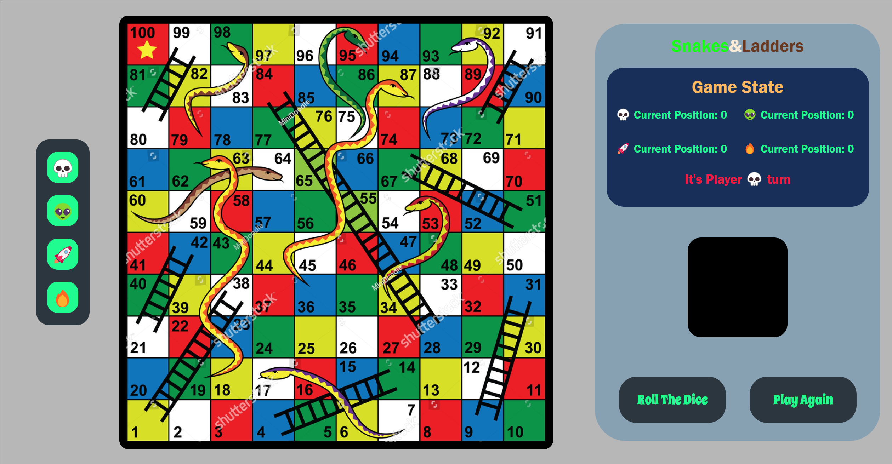
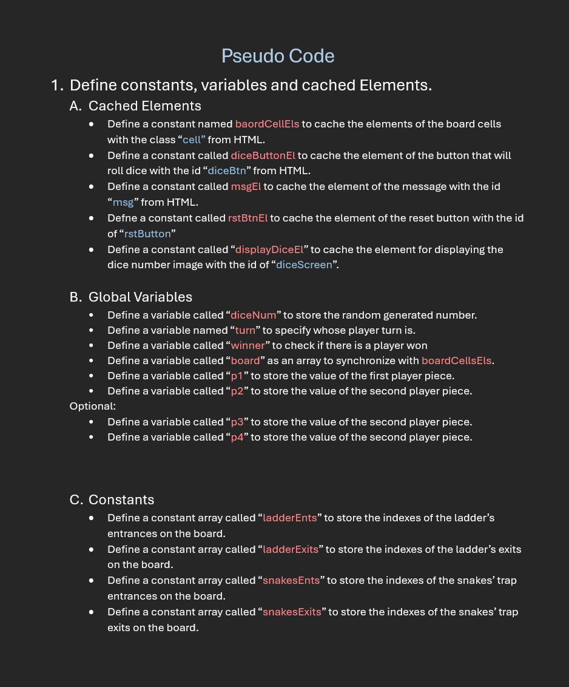

# Snakes & Ladders
A basic board game called snakes and ladders that uses a dice to move the players pieces on the board, if the player's piece got in the square that has a snake head, the snake wil swallow the player and move it down to a lower level. In the other hand, when the player's piece gets in the ladder's square then the player moves up to a higher level. Moreover, the players will still play until one of them reaches the last cell in the board which is (100) and win. I chose that game because I saw that it's concept is easy to create since there are not a lot of interactions from the user, it is just one click and the player's piece moves until it reaches 100. **You can Play the Deployed game** [here](https://a-alsaffaf.github.io/Snakes-And-Ladders/).

## Planning 

The game did take some time to plan and this Pseudo Code was the key to create my game.

Also This is the [link](/Functionality-PseudoCode.txt) to the text file for the functionalaty planning of the game. **Note:** **Some features of the game were added despite the planning, These plans were an intial form.**

## Technologies Used

For the game to be completed, many technologies were required to finish it.

### **1. HTML**

**HTML** was required in order to create the structure of the web based game's elements and contain the basic shape of it.

### **2. CSS**

**CSS** was Also responsible to style the game and make the current look of the website in term of colors and elements positions in the website. 

### **3. JavaScript**

**JavaScript (JS)** was the most required technology among the others since the basic functionality of the game in term of the generating a random number for the dice and moving the player's piece based on that number. All the features of the game in term of functionality were programmed and coded with **JS**.

### **4. Visual Studio Code**

**Visual Studio Code (VS Code)** Was the most essential tool since it was the IDE used to programm and code the game with  all of the languages mentioned above.

## Features that may get added in the future

* Adding the functionality to set the players number.
* Adding some animations.
* changing the board background to a better one.
* making the pieces more visible to the user.